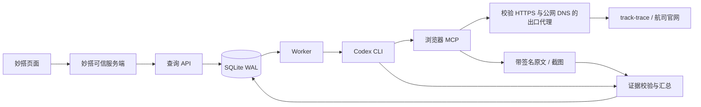

# 架构与边界

[交互式详细架构图（architecture.html）](architecture.html) 可下载后离线打开。包含六张架构图、可点击的组件职责和源码索引；按实现基线标注当前配置、部署状态与能力边界。

## 数据流

## 为什么单机使用 SQLite

第一版部署目标是一台 ECS。SQLite 的事务、WAL 和任务租约足以支持小规模并发，避免先引入 Redis、PostgreSQL 和额外运维。API、Worker 都是独立进程，共享本地持久卷。单机多个 Worker 的领取仍由数据库事务串行保护。高吞吐或多机部署需替换 Store，实现同样的接口和租约语义。

## 两种运行方式

相同业务代码可以通过 Docker Compose 或原生 systemd 运行。原生配置见 [deployment-native.md](deployment-native.md)：两个服务使用专用账号，数据存放在 `/var/lib/codex-flight-service/data`，密钥由 `LoadCredential` 注入对应服务，默认并发 1。systemd 配置在 `deploy/native/`，安装脚本为 `scripts/install-native.sh`。

原生方案省去容器管理开销，但不消除 Codex、Node 和 Chromium 的内存开销，也不具备等同容器的隔离边界。1GB 服务器仍需真实验收；默认资源上限不代表实际占用或成功率保证。

## 状态与恢复

- 新任务 `queued`；事务领取后 `running`，attempt 加一，绑定唯一 workerId 和 30 秒租约。
- Worker 每 2 秒续约；全局并发与同航司前缀限制都在领取事务内检查。
- 临时错误在预算内回到 `queued`，采用 5 秒 × 当前 attempt 的延迟。
- 超时/进程失败最多自动执行 MAX_ATTEMPTS 次。验证码和模型明确报告受阻不会无限自动重试。
- 取消请求设置持久标记；运行进程收到终止，即使晚到成功响应也以取消为准。
- 旧 workerId/attempt 或已过期租约不能写入新任务的结果。
- 重启后租约过期任务恢复；任务可能重复一次只读访问，因此不声称 exactly-once。

## 信任边界

1. API 只接受提单号列表，不接受任意提示词、Shell、网页 URL、模型名称或 Codex 配置。
2. 服务 Key 代表可信客户端（如妙搭服务端）；`X-User-Id` 由该服务端从登录上下文生成。持有服务 Key 的调用者可代表该客户端用户，因此 Key 不能给浏览器。
3. Codex 每任务单独生成配置，不加载个人 Codex 插件/MCP；禁用 Shell、unified exec、桌面浏览器、Computer Use、插件、其他 App、多 Agent、记忆和 hooks。
4. 浏览器 MCP 提供 10 个受限工具，包括导航、点击、当前提单输入、页面读取和两个专用验证码工具。验证码由现有模型看图、执行局部填写/点选/拖动/长按，并受一次性令牌和预算限制，见 [captcha.md](captcha.md)。不提供任意 JavaScript 执行、Shell、下载文件或任意 HTTP 请求工具。
5. 浏览器必须先访问 track-trace，随后依据目录及航司页面提供的链接查询本票。航司入口与页面资源无需域名白名单，均经公网 IP、HTTPS 443 的代理。旧链接或重定向中的标准 HTTP 地址自动升级为 HTTPS，307 重定向保留表单方法与内容，不向站点发送明文 HTTP 请求；非标准 HTTP 端口仍拒绝。连接前解析 DNS 并固定连接地址，拒绝内网、回环、link-local、阿里云 100.100.100.200 元数据地址等。重定向与子资源同样检查协议和公网地址。
6. 网页内容是非可信资料。查询提示词限定只读追踪操作；浏览器工具不是完整的业务防火墙，页面点击仍需要限制范围和样例回归。
7. 签名密钥仅在任务配置和 MCP 进程中短期使用，原始会话目录在结束后清理。验证后的证据保存到独立目录，仅经鉴权 API 返回。

## 证据与时间

- `navigation_attempt` 证明曾尝试某个入口，不证明页面加载成功，更不能作为实际时间来源。
- `captcha` 保存局部验证码截图、摘要和控件元数据，仅用于诊断，不证明实际时间、行程完成或无记录。
- `page` 是浏览器当时读取的页面原文，含可见表单当前值、来源完整 URL（保留 hash）、SHA-256、采集时间。截图按需保存。
- 采集包 HMAC、正文摘要、jobId 和 attempt 全部匹配后才能进入结果校验。
- 每个时间要求 evidenceId 存在、来源是非 track-trace 航司页面；quote 保留连续原文、实际标签和原始时间。提单、路线、航班和件数可通过同页上下文核实。
- 时间引用失配时，可从本次查询、同站点的官网表格记录重新核验：提单、航班及日期、航段方向、事件站点、实际状态和件数必须明确匹配，事件时间与实际航班字段须一致，且不得存在竞争的实际时间。整票记录或原文明确标识的分批记录通过后，使用官网原始时间和完整行修正引用，增加 `time_evidence_recovered`。不会补造模型未提交的时间，计划、收货、错票和明确错航段仍不接受。
- 上下文校验排除交互控件中的输入值，按框架及提单号划定范围。共享上下文指向唯一路线和航班、重复航班节点的整票件数一致时可标为已核实；多航班或拆批页面可使用归属明确的完整记录引用。本票原文和实际标签通过基础校验，但航班格式、航段或件数尚无法确认时保留时间，增加 `time_context_unverified`，首末汇总 note 标记待核实，结果保持 partial。明确错票、原文缺失或引用航班/机场与所填航段明确矛盾时仍清空字段。
- 时间保留来源字符串，只合并空白。内部比较识别明确的日期、12/24 小时制及 UTC 偏移，不补缺失年份，不改写返回值；航空两位年份按固定 1970–2069 窗口解析。有歧义的数字日期不猜日月，同一机场的当地时间可比较，不同机场缺少明确时区时不强行排序。
- 中文“实际起飞／实际出发”和“实际到达／实际抵达”分别映射 ATD / ATA，原文引用不翻译；不为英文标签重复触发验证码查询。
- 冲突 `time_conflict` 不清空已通过本票原文及实际标签校验的候选。模型可结合航班日期、路线及记录对应关系选择原文候选，并在 issues.message 说明依据、其他记录及不确定性，issues.values 保留全部冲突时间；无依据选择时字段仍为空。涉及首末汇总时，候选返回 kind=value 并附“候选时间：存在冲突，待核实”，结果保持 partial，不能据此推定全票到达。代码发现同一事件仍有多个不同时间而未指定候选时保持 kind=conflict，不按记录顺序或极值擅自选定。
- 汇总沿前后公路接驳定位真正首末空运段，与记录排列顺序无关；公路时间不替代 ATD/ATA。首发取已知最早实际出发，末到取已知最晚实际到达；到达件数尚未覆盖整票时明确标注“仅部分记录”，不把已知末批误称为整票到齐时间。只有先后无法确定时才返回 multiple，真实分批不同时间可以正常汇总。
- 按路线、航班、航班日期及原文支持的独立批次识别重复运输事件；不同格式的同一时间按同一时点处理，保留所有原始航段。模型自行改变批次名、重复引用同一行不会增加件数。同一运输事件出现不同可比较的实际时间时报告冲突，不借此制造另一批货。
- 到达件数来自对应实际到达记录的件数标签、明确的表格列或已核实的唯一上下文；不能借用重量、其他行或 RCF/NFD 等状态件数。去重后各独立末程批次的到达件数合计等于整票件数，可确认全票空运到达；件数未知、重叠、超额或记录待核实时保留时间但不确认到齐。
- 全票到达最终目的地或已有完整交付证据可确认 journeyComplete。末段空运之后还有公路运输时，空运到达不足以确认最终目的地完成。完整交付可支持件数未单独标出的单一整票末程，但不能补齐已知分批中缺失的 ATA；交付时间永不代入 ATA。
- complete 要求相关首末记录归属明确、各批实际时间能够确定首发和末到，并已确认全票完成；不同批次不再要求共用一个时间。中间航段时间缺失或不影响首末结果的冲突保留在 issues，不单独导致 partial。
- 相同路线、航班号及整票件数的互补节点可按提单口径合并，原始批次、日期和来源保留，件数不重复累加；这不表示已独立核验为同一架次。

这些检查防止常见伪造、串票和字段替代，但不能保证模型总能正确理解复杂表格的行列关系，也不能检测模型漏报的所有页面冲突。人工标注的真实查询回归和证据抽查仍是上线质量门槛。

## 执行预算与日志

Codex 子进程受任务总超时、8 MB 输出上限约束，浏览器最多 80 次操作；MCP 单调用和导航有独立超时。stdout/stderr 不原样记录，只映射为业务阶段，防止 Key、原文和模型推理进入公开日志。

`/healthz` 是 API 存活；`/readyz` 是 Worker 最近心跳。二者都不能证明模型账户和某家航司当前可用，真实 smoke 用于这项验证。
