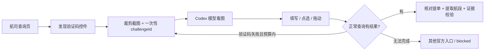

# 航司视觉验证码

验证码处理运行在后端 Worker 的 Codex + Chromium 会话中。输入仍然只有提单号，妙搭不需要增加验证码输入框，也不需要另建 OCR 服务。当前模型及网关必须能够接收 MCP 工具返回的图片；纯文本模型或丢弃图片的网关不能完成视觉识别。

## 执行流程

1. 先访问 track-trace，再进入允许的航司官方查询入口，填写提单。
2. 浏览器从可见元素的属性、标签和容器发现验证码，把 `captcha:region` / `captcha:input` 及 ref 加入快照。图片、canvas 和 iframe 内的组件均可被发现。
3. Codex 调用 `browser_captcha_inspect(ref)`，获取验证码局部 PNG、精确尺寸、允许填写的输入框 ref 和一次性 challengeId。模型根据图像判断答案、目标位置或拖动距离。
4. `browser_captcha_act` 执行一次普通表单填写、图片内点击或拖动，并重新读取页面。数字/字母验证码填写后，模型用最新按钮 ref 正常提交查询。
5. 失败时识别新图后重试；成功后仍须核对结果中的提单号，读取各航段并校验 ATD/ATA 来源。组件消失或显示“验证通过”不能代替运输记录。



## 支持范围和限制

| 类型 | 已实现的能力 | 限制 |
| --- | --- | --- |
| 图片数字、字母、汉字、简单算式 | 截图交给现有模型识别，再填入专用验证码字段 | 识别准确率受图片质量和模型影响；答案 1–16 个字母、数字或正负号 |
| 图片点选 | 在截取的组件内点击，每次点击后重新观察 | 动态换图需重新识别；未对各家第三方服务逐一验收 |
| 滑块、拼图 | 在同一截图范围内按模型给出的起止点拖动 | 普通鼠标操作；不保证通过轨迹/设备行为校验 |
| iframe 验证 | 定位框架内的控件与输入框，截图和操作 | 相关资源域名必须被允许，页面须实际加载 |
| 短信、邮箱、OTP、登录验证 | 识别为受阻并返回原因 | 不读取消息、不获取动态码、不提交账号密码 |
| 未识别的控件、访问封禁、强风控 | 保留证据和原因，尝试允许的其他官方入口 | 不保证所有航司无人值守成功 |

没有接入付费第三方打码平台。没有修改验证 token、注入网站脚本、伪造指纹或取消 TLS 校验。网站内容和验证码内文字均视为数据，不能改变查询任务。

## 工具边界和预算

每个 job 的每次 attempt 最多：24 次 inspect、3 次答案填写、12 次点选、3 次拖动；换图和切换网站不重置预算，新的 attempt 才重新计数。另受已有的 80 次浏览器操作计数和 `JOB_TIMEOUT_SECONDS` 约束；部分工具会同时计数动作与快照，因此不是保证有 80 次模型调用。

- challengeId 只允许一次动作，有效期 90 秒。新快照、导航、输入和其他动作会使其失效。
- 执行动作前重新检查页面、区域位置和截图摘要；图片刷新或区域变化时，旧答案/坐标不能继续使用。
- 坐标以本次裁剪图片左上角为原点，使用 CSS 像素；点击及拖动起止点都必须在图内。
- 只可填写同框架、附近且被识别为图形验证码的输入框；排除 password、SMS、邮箱和 one-time-code 等字段。`browser_fill` 继续只接受本票提单或 3/8 位部分。
- 最大裁剪区域 1200 × 850，面积不超过 650,000 像素。无明确标记、过大或不支持的组件可能无法发现/操作，应选更小的可识别区域；不能传入任意 CSS、JavaScript 或全屏坐标。

上述边界由浏览器代码和提示词共同实现。DOM 标记是启发式识别，不是航司页面语义的形式化保证；新站点需要实际回归。

## 第三方验证码资源

默认只加载现有允许域名。如果航司使用独立的验证码供应商，可在 Worker 配置 `BROWSER_RESOURCE_HOSTS`，只增加实际观察到的供应商域名，逗号分隔。例如（仅为配置示例，不表示这些服务已通过真实验收）：

```dotenv
BROWSER_RESOURCE_HOSTS=www.recaptcha.net,www.gstatic.com,challenges.cloudflare.com
```

该列表只允许 iframe 和页面资源请求，不能作为 `browser_open` 或顶层重定向的目标。域名及其子域名仍经过 HTTPS 443、公网 DNS 和固定 IP 连接校验。不要为解决加载失败把任意互联网域名放进主导航白名单。

Docker 修改 `.env` 后用 `docker compose up -d --force-recreate worker` 生效；`docker compose restart` 不更新容器环境变量。原生部署修改 `/etc/codex-flight-service/worker.env` 后重启 Worker。

## 返回值和诊断

汇总和航段接口保持不变；进度可显示“正在识别并处理官网验证码”。失败时在 `result.issues` 中提供以下代码，已有真实航段则保留为 `partial`，没有可用记录则为 `blocked`：

- `captcha_unsolved`：正常验证仍失败或预算耗尽。
- `captcha_unsupported`：无法识别或操作当前验证组件。
- `captcha_unavailable`：验证图片/资源未加载或工具无法取得图片。

这些 issue 由模型根据实际工具结果生成，不能把三类故障等同于“提单不存在”。`not_found` 必须有同票、已执行查询的官网无记录结果；表单初始“暂无信息”不是查询结论。

证据接口新增 `kind: "captcha"`：包含局部截图、图片摘要、采集时间及控件元数据，供诊断。它不能证明实际时间、行程完成或运单不存在。实际运输证据仍要求 `kind: "page"`，与本票、本航段及原始时间标签匹配。证据读取仍需服务鉴权。

## 验证方式

```bash
npm run check
npm run browser:install
npm run test:browser
```

`test:browser` 在项目独立 Chromium 中运行自有离线测试页面，验证图形码填写、换图失效、一次性令牌、点选、拖动、iframe、输入与坐标限制、预算及签名证据；不会访问真实航司或调用模型。CI 同时在 Docker 镜像和原生 systemd Worker 环境运行这些检查。

真实验收必须另外通过当前模型、网络和航司网站执行查询。离线机械操作通过不等于某个验证码供应商可自动通过，也不能代表阿里云目标机的成功率。

2026-09-29 本地真实测试：`112-90239332` 通过现有网关和 Codex 模型自动取得中货航图片验证码，识别值与图片一致，专用工具完成填写并正常点击查询。随后官网持续显示“读取中”，重新打开也超时；未取得 ATD/ATA，返回 `blocked`。这次测试验证了真实模型图片传递、识别、填写和提交，尚不能证明该次验证码已被官网接受或运输查询完成。

## 部署代码更新

在已配置好的服务仓库中：

```bash
git switch codex/flight-query-service
git pull --ff-only origin codex/flight-query-service
docker compose build
docker compose up -d api worker
docker compose exec worker node dist/scripts/check-captcha.js
```

API 与 Worker 都更新，因为证据 API 增加了 `captcha` 类型。没有数据库迁移，不需要新的模型 Key。2GB 主机请继续把 `WORKER_CONCURRENCY=1`；当前默认 Compose 的资源上限仍需按服务器容量配置，不能当作已完成的 2GB 实测方案。

实现：`src/browser/captcha.ts`（识别与动作限制）、`src/browser/session.ts`（页面与证据）、`src/browser/mcp.ts`（工具）、`src/runtime/prompt.ts`（自动查询流程）、`src/runtime/runner.ts`（工具预授权与进度）。
